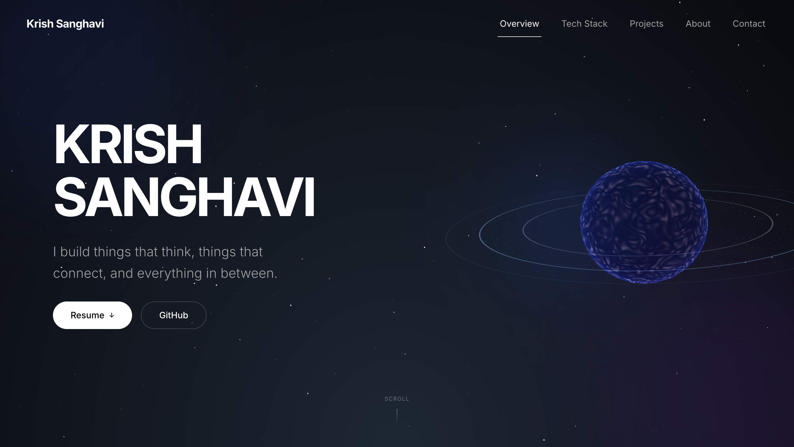

<p align="center">
  
</p>
<h1 align="center">Krish Sanghavi — Portfolio</h1>
<p align="center">
  <a href="https://krishcodes.dev"><strong>Live Website</strong></a>
</p>
<p align="center">
  
  
  
  
  
</p>
<p align="center">
  
</p>

> This is my personal digital portfolio built with **Next.js 15, Three.js, and GSAP**.
---
## Features
- **Boot sequence** — Rocket launch + terminal animation on first load, skipped on sub-pages.
- **3D Orbital Tech Stack** — Scroll-driven GSAP animation with interactive Three.js orbital system.
- **Spacebar navigation** — Press **Space** to jump between sections
- **Projects** — Hackathon and independent projects with links to code and demos.
- **About** — Animated HUD-style bento grid with a skill radar chart
- **Contact form** — Validated form with Resend email delivery and honeypot spam protection.
- **Vercel Analytics** — Traffic insights out of the box
- **Responsive** — Adaptable UI with a collapsible hamburger nav for mobile devices and optimized layouts throughout.
---
## Tech Stack
| Layer | Technology |
|---|---|
| **Framework** | Next.js 15 (App Router) |
| **Language** | TypeScript |
| **Styling** | Tailwind CSS v4 |
| **Animation** | Framer Motion, GSAP + ScrollTrigger |
| **3D** | Three.js, React Three Fiber, Drei |
| **Smooth Scroll** | Lenis |
| **Email** | Resend |
| **Analytics** | Vercel Analytics |
| **State** | Zustand |
| **Deployment** | Vercel |

  ---

  ## Getting Started

### Prerequisites

- Node.js 18+
- npm
### Environment Variables
  Create a `.env.local` file in the root:
```
  RESEND_API_KEY=your_resend_api_key
  CONTACT_EMAIL=your@email.com
```
### Run Locally
```
npm run dev
```
### Installation
```
npm install
```
### Open 
```http://localhost:3000```

### Build
```
npm run build
npm start
```
---
## Deployment
Deployed on Vercel — push to main and it deploys automatically.
Add all ```.env.local``` variables to your Vercel project settings.

---
## Contact

**Krish Sanghavi**

🌐 Website — [krishcodes.dev](https://krishcodes.dev)  
💻 GitHub — [@krishcodes-dev](https://github.com/krishcodes-dev)  
🔗 LinkedIn — [krishsanghavi0909](https://www.linkedin.com/in/krishsanghavi0909)  
📷 Instagram — [@krishsanghavi_](https://instagram.com/krishsanghavi_)

---
If you like this project, consider giving it a ⭐
  
